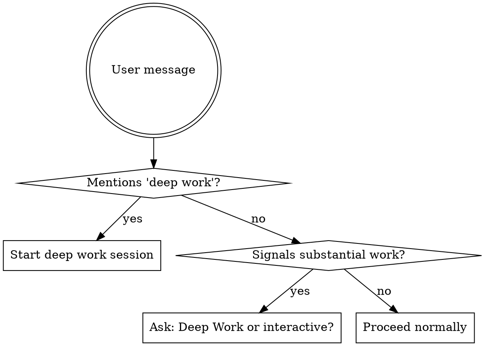

# Deep Work Session

## Overview

Set up a focused working session with preferences established upfront, enabling autonomous execution with minimal interruption.

**Core principle:** Front-load decisions so the agent can work autonomously.

**When to use:**
- User explicitly mentions "deep work" → definite trigger
- User signals substantial work ("let's build X", "let's implement X") → ask first

**When NOT to use:**
- Simple questions or quick fixes
- User dives directly into a specific task without signaling session intent
- Information requests

## Trigger Behavior



**Substantial work signals:**
- "Let's build/implement/create X"
- "I want to work on X"
- Multi-step requests
- Feature development, refactoring, complex fixes

**Use the question tool to ask:**
> "Would you like to start a Deep Work session (autonomous execution with upfront planning) or work interactively?"
> Options: Deep Work session, Interactive style

## Session Setup

**Announce:** "Starting Deep Work session. Let me gather a few preferences upfront."

### Step 1: Analyze Task and Present Defaults

Analyze what the user wants to do and present a proposed configuration:

```
Deep Work session for: [task description]

Proposed configuration:
- Commits: Auto-commit after each task
- Questions: Front-loaded (ask everything now, then work autonomously)
- Scope: [inferred - e.g., "src/components/", "no breaking changes"]
- Skills: [relevant skills - e.g., "TDD, verification-before-completion"]

Which would you like to change?
```

**Use the question tool with multiple selection:**
- Commit preference
- Question style  
- Scope boundaries
- Skills to use
- None - looks good

### Step 2: Gather Changes (if any)

Only ask follow-up questions for items the user selected to change.

**Commit options:**
- Auto-commit after each task (default)
- Ask before each commit
- Batch commits at end
- No commits (user handles)

**Question style options:**
- Front-loaded then minimal (default) - ask foreseeable questions now, then only interrupt if truly blocked
- Minimal - proceed unless blocked, no upfront gathering
- Checkpoint - pause at major decision points
- Collaborative - frequent check-ins

**Scope options** (ask whichever are relevant):
- Files/directories to focus on or avoid
- Change magnitude (small fix, refactor, rewrite)
- Testing requirements
- Time/effort budget

**Skills options:**
- Present skills that seem relevant to the task
- Let user confirm or decline each

### Step 3: Plan the Workflow

Based on the task, propose a sequence of skills:

```
Proposed workflow:
1. brainstorming - explore the design
2. writing-plans - create implementation plan
3. subagent-driven-development - execute with fresh agents per task

Does this workflow look right?
```

**Use the question tool:**
- Yes, proceed
- Adjust workflow (let me specify)

**Common workflows:**

| Task Type | Typical Workflow |
|-----------|------------------|
| New feature (unclear scope) | brainstorming → writing-plans → subagent-driven-development |
| New feature (clear spec) | writing-plans → subagent-driven-development |
| Bug fix | systematic-debugging → TDD fix → verification |
| Refactoring | writing-plans → executing-plans |
| Exploration | brainstorming only |

### Step 4: Confirm and Begin Front-Loaded Work

Summarize the session configuration:

```
Deep Work session configured:
- Commits: Auto-commit
- Questions: Front-loaded then minimal
- Scope: [summary]
- Workflow: brainstorming → writing-plans → subagent-driven-development

Starting with brainstorming...
```

Now proceed with the front-loaded work (brainstorming, planning) as configured.

### Step 5: Before Implementation - Fresh Session Option

**After all front-loaded work is complete** (brainstorming done, plan written) but **before autonomous implementation begins**, use the question tool to ask:

> "Planning complete. Implementation is ready to begin. How would you like to proceed?"
>
> Options:
> 1. **Continue in this session** - Start implementation now
> 2. **Fresh session for implementation** - Hand off to maximize context for implementation

**Why offer this?**
- Brainstorming and planning can consume significant context
- Implementation benefits from maximum available context
- A fresh session starts with full context capacity
- All decisions are captured in the plan, so nothing is lost

**If "Fresh session for implementation" chosen:**
1. Use superpowers:session-handoff to write a comprehensive handoff document
2. Include all deep work preferences AND the completed plan
3. The handoff should note: "Planning complete. Ready for implementation phase."
4. Provide the continuation prompt for starting implementation in a fresh session

**If "Continue in this session" chosen:**
- Proceed directly to implementation (subagent-driven-development or executing-plans)
- No handoff needed

## Context Propagation

When invoking downstream skills, pass the session context:

**For all skills:**
```
[DEEP WORK SESSION]
- Commit preference: [auto/ask/batch/none]
- Question style: [front-loaded/minimal/checkpoint/collaborative]
- Scope: [boundaries]

Operate with maximum autonomy. User has answered foreseeable questions.
If question style is "front-loaded then minimal": only interrupt if truly blocked.
```

**For brainstorming specifically:**
- Brainstorming remains interactive (that's its nature)
- But focus on gathering everything needed for autonomous execution
- At the end, explicitly ask: "Is there anything else I should know before proceeding autonomously?"

## Session Preferences Reference

These preferences persist for the entire session. Other skills should check if they're already set before asking.

| Preference | Key | Values |
|------------|-----|--------|
| Commits | `COMMIT_PREFERENCE` | `auto`, `ask`, `batch`, `none` |
| Questions | `QUESTION_STYLE` | `front-loaded`, `minimal`, `checkpoint`, `collaborative` |
| Scope | `SCOPE_BOUNDARIES` | Free text |
| Skills | `SKILL_WORKFLOW` | Ordered list |

## Context Management

Deep work sessions may exceed the context window.

**REQUIRED SUB-SKILL:** Use superpowers:session-handoff for all context management.

When approaching context limits (75-85%), the session-handoff skill handles:
- Writing comprehensive handoff documents
- Guiding the user to continue in a new session
- Ensuring no context is lost

**Key points for deep work:**
- Target winddown at 80-90% context usage
- Include all deep work preferences in the handoff document
- Use the deep work continuation prompt from session-handoff

## Continuing a Deep Work Session

When the user says they're continuing a deep work session and provides a handoff file path:

**REQUIRED SUB-SKILL:** Use superpowers:session-handoff to read and restore from the handoff document.

After restoring context from the handoff:

1. **Verify deep work preferences are restored** - commits, question style, scope, workflow
2. **Announce the restored configuration:**

```
Continuing Deep Work session from [handoff file].

Restored configuration:
- Commits: [from handoff]
- Questions: [from handoff]  
- Scope: [from handoff]
- Workflow: [from handoff]

Progress: [X of Y tasks complete]
Resuming from: [current task]
```

3. **Resume autonomously** - preferences already gathered, continue with maximum autonomy

## Red Flags

**MUST NOT:**
- Re-ask preferences when continuing from a handoff - trust the document
- Start deep work session for simple questions
- Skip preference gathering ("I'll just use defaults")
- Forget to pass session context to downstream skills
- Interrupt during autonomous work unless truly blocked
- Ask questions that were already answered in setup

**MUST:**
- Ask "Deep Work or interactive?" when uncertain about user intent
- Use session-handoff skill when approaching context limits
- Monitor context usage and plan winddown at 80-90%

**SHOULD:**
- Present smart defaults based on task analysis
- Propose workflow and let user confirm
- Pass full session context to every skill invoked
- Trust the front-loaded decisions during execution
- Use `checklimits` tool proactively if unsure about remaining context

## Integration

**Required sub-skills:**
- `session-handoff` - for context management and session continuity
- `making-commits` - for commit mechanics when `COMMIT_PREFERENCE` allows commits

**Skills that should check for existing session preferences:**
- `writing-plans` - check `COMMIT_PREFERENCE` and `QUESTION_STYLE` before asking
- `subagent-driven-development` - check `COMMIT_PREFERENCE` and `QUESTION_STYLE` before asking
- `brainstorming` - adjust verbosity based on `QUESTION_STYLE`
- `executing-plans` - respect `COMMIT_PREFERENCE` and `QUESTION_STYLE`

**Skills this typically hands off to:**
- `brainstorming` - for unclear scope
- `writing-plans` - for clear spec
- `systematic-debugging` - for bug fixes
- `subagent-driven-development` or `executing-plans` - for implementation
