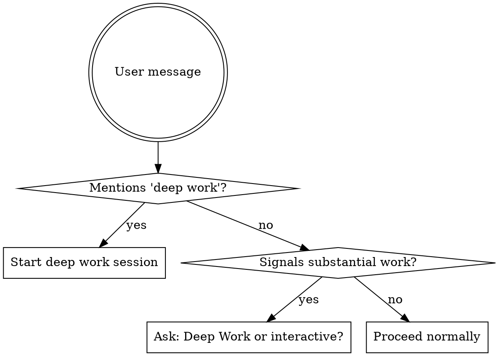

# Deep Work Session

## Overview

Set up a focused working session with preferences established upfront, enabling autonomous execution with minimal interruption.

**Core principle:** Front-load decisions so the agent can work autonomously.

**When to use:**
- User explicitly mentions "deep work" → definite trigger
- User signals substantial work ("let's build X", "let's implement X") → ask first

**When NOT to use:**
- Simple questions or quick fixes
- User dives directly into a specific task without signaling session intent
- Information requests

## Trigger Behavior



**Substantial work signals:**
- "Let's build/implement/create X"
- "I want to work on X"
- Multi-step requests
- Feature development, refactoring, complex fixes

**Use the question tool to ask:**
> "Would you like to start a Deep Work session (autonomous execution with upfront planning) or work interactively?"
> Options: Deep Work session, Interactive style

## Session Setup

**Announce:** "Starting Deep Work session. Let me gather a few preferences upfront."

### Step 1: Analyze Task and Present Defaults

Analyze what the user wants to do and present a proposed configuration:

```
Deep Work session for: [task description]

Proposed configuration:
- Commits: Auto-commit after each task
- Questions: Front-loaded (ask everything now, then work autonomously)
- Scope: [inferred - e.g., "src/components/", "no breaking changes"]
- Skills: [relevant skills - e.g., "TDD, verification-before-completion"]

Which would you like to change?
```

**Use the question tool with multiple selection:**
- Commit preference
- Question style  
- Scope boundaries
- Skills to use
- None - looks good

### Step 2: Gather Changes (if any)

Only ask follow-up questions for items the user selected to change.

**Commit options:**
- Auto-commit after each task (default)
- Ask before each commit
- Batch commits at end
- No commits (user handles)

**Question style options:**
- Front-loaded then minimal (default) - ask foreseeable questions now, then only interrupt if truly blocked
- Minimal - proceed unless blocked, no upfront gathering
- Checkpoint - pause at major decision points
- Collaborative - frequent check-ins

**Scope options** (ask whichever are relevant):
- Files/directories to focus on or avoid
- Change magnitude (small fix, refactor, rewrite)
- Testing requirements
- Time/effort budget

**Skills options:**
- Present skills that seem relevant to the task
- Let user confirm or decline each

### Step 3: Plan the Workflow

Based on the task, propose a sequence of skills:

```
Proposed workflow:
1. brainstorming - explore the design
2. writing-plans - create implementation plan
3. subagent-driven-development - execute with fresh agents per task

Does this workflow look right?
```

**Use the question tool:**
- Yes, proceed
- Adjust workflow (let me specify)

**Common workflows:**

| Task Type | Typical Workflow |
|-----------|------------------|
| New feature (unclear scope) | brainstorming → writing-plans → subagent-driven-development |
| New feature (clear spec) | writing-plans → subagent-driven-development |
| Bug fix | systematic-debugging → TDD fix → verification |
| Refactoring | writing-plans → executing-plans |
| Exploration | brainstorming only |

### Step 4: Confirm and Hand Off

Summarize the session configuration:

```
Deep Work session configured:
- Commits: Auto-commit
- Questions: Front-loaded then minimal
- Scope: [summary]
- Workflow: brainstorming → writing-plans → subagent-driven-development

Starting with brainstorming...
```

## Context Propagation

When invoking downstream skills, pass the session context:

**For all skills:**
```
[DEEP WORK SESSION]
- Commit preference: [auto/ask/batch/none]
- Question style: [front-loaded/minimal/checkpoint/collaborative]
- Scope: [boundaries]

Operate with maximum autonomy. User has answered foreseeable questions.
If question style is "front-loaded then minimal": only interrupt if truly blocked.
```

**For brainstorming specifically:**
- Brainstorming remains interactive (that's its nature)
- But focus on gathering everything needed for autonomous execution
- At the end, explicitly ask: "Is there anything else I should know before proceeding autonomously?"

## Session Preferences Reference

These preferences persist for the entire session. Other skills should check if they're already set before asking.

| Preference | Key | Values |
|------------|-----|--------|
| Commits | `COMMIT_PREFERENCE` | `auto`, `ask`, `batch`, `none` |
| Questions | `QUESTION_STYLE` | `front-loaded`, `minimal`, `checkpoint`, `collaborative` |
| Scope | `SCOPE_BOUNDARIES` | Free text |
| Skills | `SKILL_WORKFLOW` | Ordered list |

## Context Management

Deep work sessions may exceed the context window. A hook injects context usage updates at 25%, 50%, 75%, then every 5% until 95%, then every 1% until 100%. You can also call the `checklimits` tool proactively.

### CRITICAL: Understanding Context Loss

**The new session will have ZERO context from the current session.**

This is not like "pausing" - this is a complete reset. The next agent:
- Has no memory of this conversation
- Does not know what files you looked at
- Does not know what decisions you made or why
- Does not know what the user said
- Does not know what you learned about the codebase
- Only knows what is written in the handoff document

**If it's not in the handoff document, it does not exist for the next agent.**

You are not "handing off to yourself" - you are writing instructions for a stranger who happens to have the same capabilities. Everything you currently "just know" from this session MUST be explicitly written down or it is lost forever.

### Monitoring Context Usage

At each context update, assess:
- How much work remains?
- Is there risk of running out before completing the task?
- Early updates (25%, 50%) usually don't have enough info to judge

### When to Wind Down

**Target: Start winddown at 80-90% context usage.**

- Not too early (waste context capacity)
- Not too late (need context for winddown steps, and model performance degrades after 90-95%)

**Trigger winddown when:**
- Context usage is 75-85% AND
- Remaining work likely exceeds remaining context AND
- You can reach a reasonable stopping point

### Winddown Process

1. **Finish current atomic task** - Complete to a stopping point, don't leave things half-done
2. **Write handoff document** - You MUST use template in `./handoff-template.md`. You MUST NOT skip sections. You MUST NOT write brief summaries assuming the next agent "will figure it out."
3. **Save to predictable location** - `docs/deep-work-handoffs/YYYY-MM-DD-HH-MM-<topic>.md`
4. **Ask user to continue** - Use question tool:

> "I'm approaching my context limit. I've written a detailed handoff document ready to continue in a new session. Ready to continue?"
> Options: Yes, continue in new session / Not yet, I have questions

5. **Provide continuation prompt:**

```
I'm continuing a previous deep work session. Use the deep-work-session skill to continue. The handoff document is at:
docs/deep-work-handoffs/[filename].md

Read that file and continue the deep work session autonomously.
```

The user will copy this into a new session.

## Continuing a Session

When the user says they're continuing a deep work session and provides a handoff file path:

### CRITICAL: You Have No Prior Context

**You are not "continuing" - you are starting fresh with a briefing document.**

You have no memory of the previous session. You do not know:
- What the user said before
- What was tried and failed
- What decisions were made or why
- What the user's preferences are
- What files are relevant

The handoff document is your ONLY source of context. You MUST read it completely and trust its contents.

### Step 1: Read Handoff Document

You MUST read the file completely before taking any action. It contains:
- All session preferences (commits, questions, scope, workflow)
- Task context and progress
- What was done, what remains
- Technical decisions and reasoning
- Open questions or blockers
- User preferences and quirks

### Step 2: Restore Session State

You MUST NOT re-ask preferences. The handoff document has them. Announce:

```
Continuing Deep Work session from [handoff file].

Restored configuration:
- Commits: [from handoff]
- Questions: [from handoff]  
- Scope: [from handoff]
- Workflow: [from handoff]

Progress: [X of Y tasks complete]
Resuming from: [current task]
```

### Step 3: Resume Autonomously

- Pick up exactly where the previous session left off
- Follow the same workflow and preferences
- Continue with maximum autonomy (preferences already gathered)

### Step 4: Handle Accumulated Context

If this is a continuation of a continuation (chain of handoffs):
- The handoff document should reference prior handoffs if relevant
- Consolidate understanding, don't re-read entire chain
- Focus on current state and remaining work

## Red Flags

**MUST NOT:**
- Write a sparse handoff document - the next agent has ZERO context from your session
- Assume the next agent "will figure it out" - it will not, it cannot
- Skip sections in the handoff template - every MUST section is required
- Write vague next steps like "continue implementing" - be specific
- Re-ask preferences when continuing from a handoff - trust the document
- Ignore context usage warnings until it's too late to write a proper handoff

**SHOULD NOT:**
- Start deep work session for simple questions
- Skip preference gathering ("I'll just use defaults")
- Forget to pass session context to downstream skills
- Interrupt during autonomous work unless truly blocked
- Ask questions that were already answered in setup
- Start winddown too early (wasting context) or too late (can't complete handoff)

**MUST:**
- Ask "Deep Work or interactive?" when uncertain about user intent
- Write handoff documents as if explaining to a stranger (because you are)
- Include the "why" for every technical decision, not just the "what"
- Capture user preferences and quirks explicitly
- Monitor context usage and plan winddown at 80-90%

**SHOULD:**
- Present smart defaults based on task analysis
- Propose workflow and let user confirm
- Pass full session context to every skill invoked
- Trust the front-loaded decisions during execution
- Use `checklimits` tool proactively if unsure about remaining context

## Integration

**Skills that should check for existing session preferences:**
- `writing-plans` - check `COMMIT_PREFERENCE` before asking
- `subagent-driven-development` - check `COMMIT_PREFERENCE` before asking
- `brainstorming` - adjust verbosity based on `QUESTION_STYLE`
- `executing-plans` - respect `COMMIT_PREFERENCE` and `QUESTION_STYLE`

**Skills this typically hands off to:**
- `brainstorming` - for unclear scope
- `writing-plans` - for clear spec
- `systematic-debugging` - for bug fixes
- `subagent-driven-development` or `executing-plans` - for implementation
